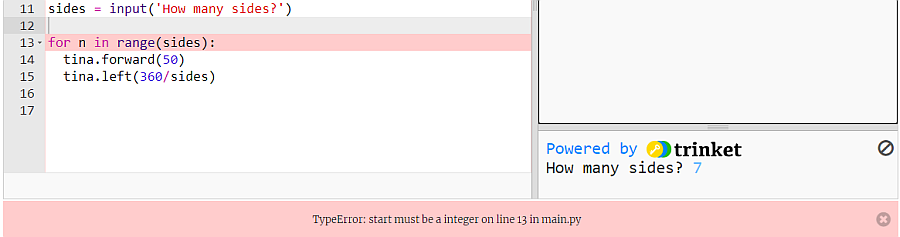
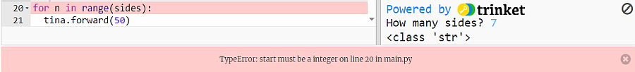

# Summary of Python session on 28th October 2023

### Recap of ```for``` loop

We started looking at the [List of numbers](https://hourofpython.trinket.io/a-visual-introduction-to-python#/repeating-with-loops-and-lists/lists-of-numbers) task from the Hour of Python tutorial to study the way a Python ```for``` loop is constructed:

1. the word ```for```
2. a variable - you can choose the name, but here they use ```number```
3. the word ```in```
4. a list (here it is a list of numbers but you can use any list)
5. a colon ```:``` at the end of the line
6. all the lines of code which you want to repeat must be ***indented***

We recalled that if you want a Python ```for``` loop to run a set number of times you simply need a list containing that number of items.

### Practise writing a ```for``` loop

Next we went to a starter project [Moving tina](https://trinket.io/python/383a4b9b63) where we wrote code to make a turtle go round a square shape twice. We wanted to reduce all the lines of code for moving the turtle to just three lines, using a ```for``` loop.

Work out 1) what lines of code are being repeated; 2) how many times those lines are repeated; 3) write a ```for``` loop to do the same task with just three lines of code - refer to the Hour of Python task to guide you. Try to do this yourself before looking at the solution.

<details><summary>Click here to see one way to do it</summary>

```python
for n in [1,2,3,4,5,6,7,8]:
  tina.forward(50)
  tina.left(90)
```
  
</details>

### Python ```range()``` function

If you wanted to repeat code 100 or 1000 times it would be ridiculous to type a list containing that many items, so Python has a function called ```range()``` which generates an automatic list. We opened the trinket [Python console](https://trinket.io/console) to investigate the ```range()``` function.

Type ```range()``` with a number in the brackets into the Console and press Enter. Look at the list which is generated. Experiment with a different number. Can you see the pattern?

Now type ```range()``` with two numbers in the brackets separated by a comma, and press Enter. The first number should be smaller. What is happening now? Can you work out what the numbers are doing? Example: ```range(5,20)```

Now type ```range()``` with three numbers in the brackets separated by a commas, and press Enter. The first number should be smaller than the second, and the third number should also be small. What is happening now? Can you work out what the numbers are doing? Example: ```range(5,20,2)```

**Challenge**: use ```range()``` with three numbers in the brackets to make this list:

```python
[10,9,8,7,6,5,4,3,2,1,0]
```

<details><summary>Solution</summary>

```python
range(10,-1,-1)
```
  
</details>

Go back to the *Moving tina*  project and replace the list with a ```range()``` function which will do the same thing. Now change the ```range()``` function so the turtle only goes round the square *once*.

### Drawing a shape with a different number of sides

We wanted to change the code to draw a six-sided figure - a *hexagon*. We found we needed to change the number in the ```range()``` function, ***and*** the number in the ```tina.left()``` line.  Try to make ```tina``` draw a hexagon.

<details><summary>Solution</summary>

```python
for n in range(6):
  tina.forward(50)
  tina.left(60)
```
  
</details>

We calculated the angle in the ```tina.left()``` line but we can get Python to calculate this angle. We need to divide a complete turn (360°) by the number of sides. We found that the best way to do this in code was to make a Python *variable* called ```sides``` and set it equal to the number of sides we want. So for a seven-sided figure we would use

```python
sides = 7
```

Put this line before the ```for``` loop then edit the ```for``` loop to use the variable instead of the number of sides.

<details><summary>for loop using sides variable</summary>

```python
for n in range(sides):
  tina.forward(50)
  tina.left(360/sides)
```
  
</details>

### Asking the user how many sides

We could have our code ask the user how many sides for the shape using the Python ```input()``` function. Look at the Hour of Python task [Saying Hello](https://hourofpython.trinket.io/a-visual-introduction-to-python#/turtles/saying-hello) to check on the ```input()``` function - you will have to go down to the *second* trinket on this page.

Replace the line where we set the ```sides``` variable to a number with this line:

```python
sides = input('How many sides?')
```

then run the code. You should click your mouse once in the box beside where the question appears before typing your answer, then press Enter. Oh no!!!!! We've got an error!



The writing on the pink background tells us that this is a TypeError and that the error is on line 13 of the code. This is useful information. But, what do we mean by a type error?

### Types of Python object

We learnt that Python variables can be of different ***types***, and we investigated the type of different Python variables by going back to the Python console and using the ```type()``` function. In the console we made some variables and checked on their type:

```
>>> sides = 7
>>> type(sides)
<class 'int'>
>>> myname = 'Simon'
>>> type(myname)
<class 'str'>
>>> decimal = 6.75
>>> type(decimal)
<class 'float'>
>>>
```

'int' stands for integer - this is for a whole number variable
'str' stands for string - this is a text string - a variable set with quotes at the beginning and end
'float' stands for floating-point - this is a reference to the way a computer stores decimal numbers

In Python you have to be aware of what type of object you are using because you some operations can only be done with the right type of variable.

The ```range()``` function will ***only*** work if you put *integer* objects inside the brackets. But when we ran the code to draw a 7-sided figure we typed an integer, so why did it give an error?

We found you can investigate the type of a variable in the code. We added this line after the ```input()``` line:

```
print(type(sides))
```

then when we ran the code it printed the type of the variable ```sides``` in the Results box:



This tells us that although we typed an integer into the answer box the variable ```sides``` is a *string* variable. ***This is because whenever you use a Python ```input()``` function it always outputs a string variable, regardless of what you type in.***

Luckily there is another Python function, ```int()``` which converts variables which are not integers into type integer. We added the line to do this after the ```print(type(sides))``` line:

```
sides = int(sides)
```

This takes variable sides (a text string ), converts it into an integer, and puts the result back in variable sides. We checked this had worked by repeating the ```print(type(sides))``` line after we'd made the type conversion. Now the code runs properly because the ```range()``` function has an integer variable to use.

### Getting Python to calculate your age

We went to a starter project [How_old](https://trinket.io/python/4ff4e55316) to write code for an Age Calculator programme. Remix this project, so you can save it in your account.
